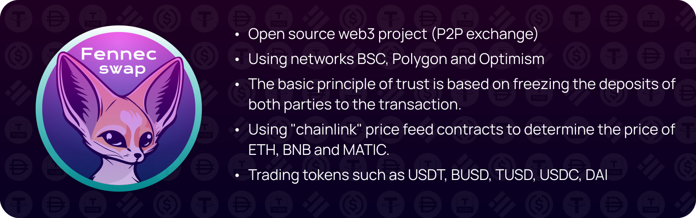

<br/>
<p align="center">

</p>
<br/>

## Manual for build and tests
___

**Installing** (first of all install [foundry](https://book.getfoundry.sh/))

```bash
git clone https://github.com/FennecTechnology/FennecSwap.git && cd FennecSwap
```

```bash
forge install smartcontractkit/chainlink, OpenZeppelin/openzeppelin-contracts, foundry-rs/forge-std
```

```bash
forge build
```

**Running a local blockchain node (Anvil)**

```bash
anvil
```

**Testing contracts**
```bash
forge test
```